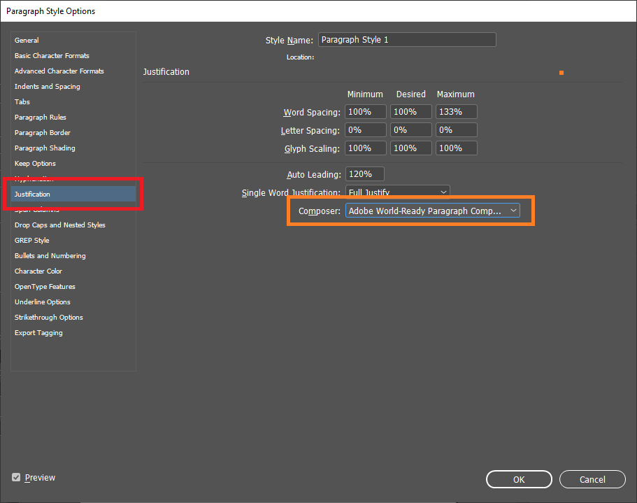

# නිතර අසන පැන (FAQs)

## Unicode (යුනිකේත) අකුරු කැතයිනේ, ඉස්සර තිබ්බ විදියට තිබ්බනම් ඉවරයි.

Unicode කියන්නෙ Font වර්ගයක් නෙමෙයි. Unicode කියන්නේ තාක්ෂණයක් නැතිනම් සම්මතයක්. Unicode සම්මතයට අනුව සකස් කරපු Unicode
Fonts විශාල ගණනක් තියෙනවා. ඒවායින් සිංහල අකුරු සඳහා සහය දක්වන Fonts විශාල ගණනක් තියෙනවා. ඒවගේම අලුතින් නිර්මාණය වෙමින්
පවතිනවා. බොහෝ විට මෙම අදහස ඇතිවෙන්නේ Iskoola Potha කියන Font එක තමයි Unicode කියන වැරදි මතය නිසායි. `Iskoola Potha`
කියන්නේ Microsoft සමාගම විසින් Windows පරිගණක පද්ධතිය සමඟ ලබා දෙන එක් යුනිකේත Font වර්ගයක් පමණයි. ඔබ මුද්‍රණය සඳහා
සුදුසු Font එකක් සොයනවානම් පැරණි `FM Abhaya` අනුවම සකස් කරපු `Abhaya Libre Font` එක භාවිතා කරන්න පුළුවන්.

## මුද්‍රණය සඳහා Unicode භාවිතා කරන්න බෑ නේද?

මේක පරණ කතාවක්. දැන් මේක වලංගු නෑ. වානිජ මෘදුකාංගයක් වෙන InDeign ඇතුළු සියළුම Adobe මෘදුකාංග වල නවතම සංස්කරණ ද, Scribus
විවෘත මෘදුකාංගය ද Unicode සඳහා සහය දක්වයි.

* InDesign මෘදුකාංගයේ නිිවැරදිව සිංහල Unicode තාක්ෂණය භාවිතා කරන Fonts දිස්වීම සදහා මේ ආකාරයට justification settings
  වෙනස් කරන්න.
  
